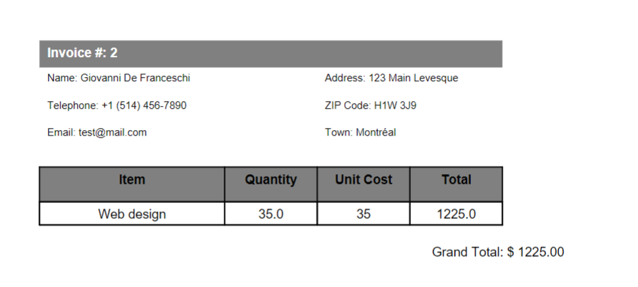

# Freelance Jobs Invoice Creator


## Overview
This is a Python program that simplifies the process of creating invoices for freelance services. It provides a user-friendly graphical interface built using Tkinter. Key features include:

- **Invoice Number:** You can input the invoice number.
- **Hours Worked:** Input the number of hours worked for the service.
- **Service Type:** Select the type of service from a dropdown list.
- **Generate Invoice:** Click the "Generate Invoice" button to create a professional PDF invoice.

## Code Highlights
- Utilizes Tkinter for the graphical user interface.
- Calculates the total amount based on the hourly rate and hours worked.
- Stores client information and invoice details.
- Uses an external `pdf_generator` module for PDF invoice generation.
- The generated PDF is saved in a specified folder.

## Usage
1. Enter the invoice number in the "Invoice Number" field.
2. Input the number of hours worked in the "Hours Worked" field.
3. Select the service type from the dropdown menu.
4. Click the "Generate Invoice" button to create the invoice in PDF format.

## Sample Invoice

Here's a sample of what the generated invoice looks like:



## Dependencies
- Python 3.x
- Tkinter (for GUI)
- `pdf_generator` (external module for PDF generation)
- `datetime` (for date handling)

## Installation
Make sure you have Python 3.x installed, and then install the required dependencies using pip:

```bash
pip install pdf_generator
pip install reportlab
```

## Author
**Giovanni De Franceschi**


[GitHub Profile](https://github.com/alfettox)
